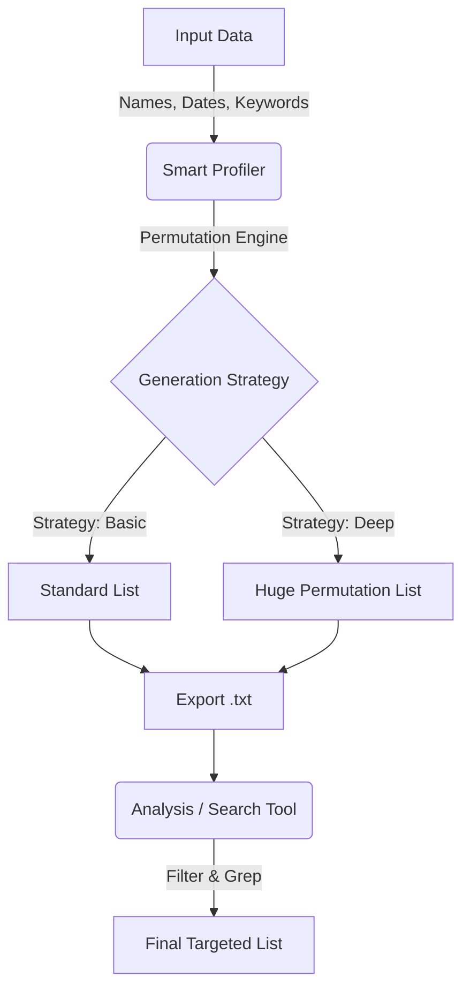
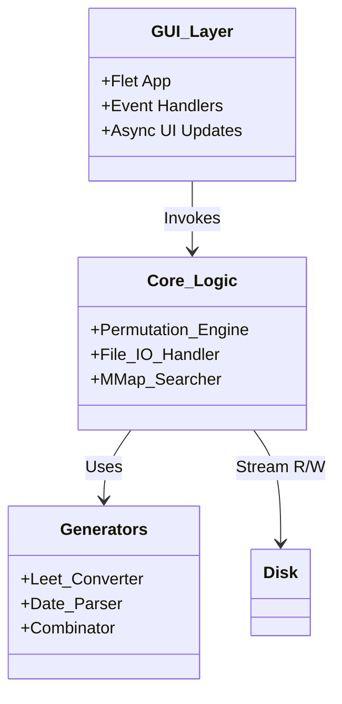
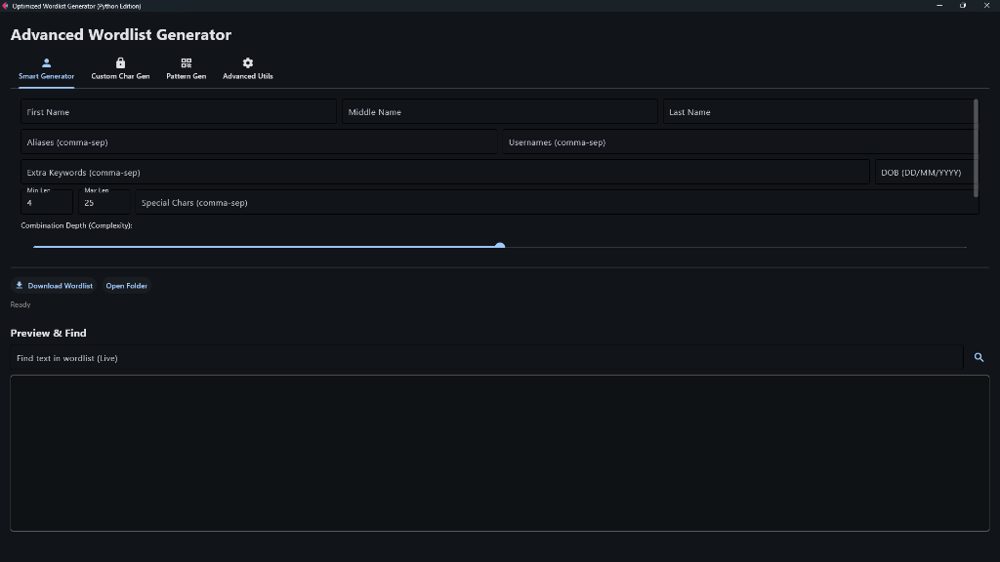
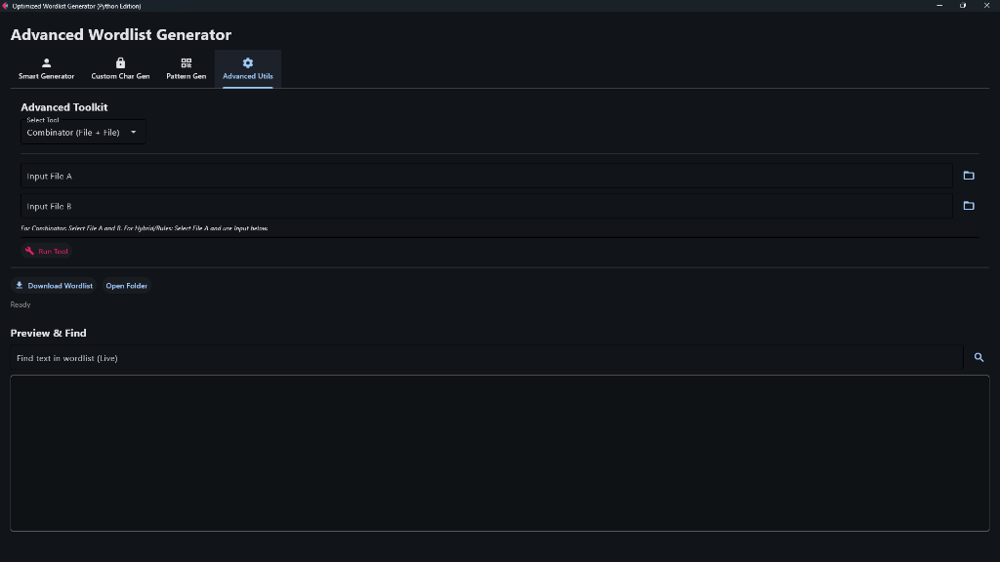
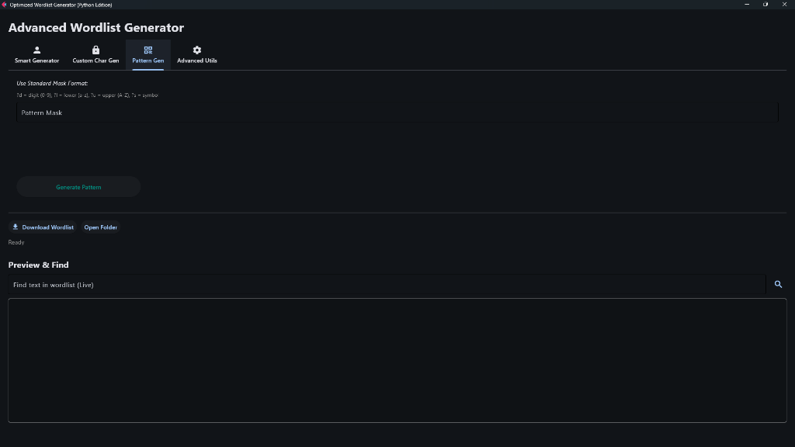
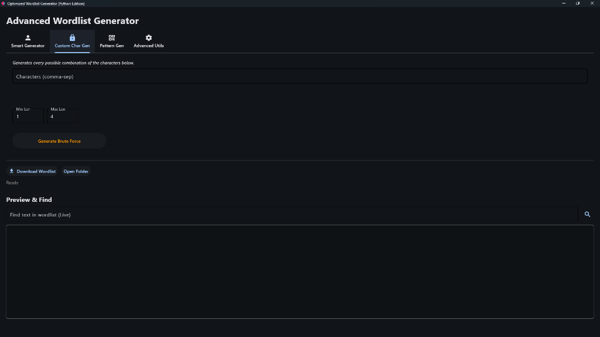

<div align="center">

# 🔐 Ultra-Fast Wordlist Generator
### Precision Password Profiling & Analysis Suite


<p align="center">
  <a href="#-overview">Overview</a> •
  <a href="#-features">Features</a> •
  <a href="#-installation">Installation</a> •
  <a href="#-usage">Usage</a> •
  <a href="#-architecture">Architecture</a> •
  <a href="#-contributing">Contributing</a>
</p>

</div>

---

## 📋 Overview

**Wordlist Generator** is a high-performance, zero-dependency password profiling and wordlist generation suite designed for security professionals and penetration testers. Unlike generic tools that dump random permutations, this tool uses smart profiling to generate highly targeted wordlists based on known entity information (names, dates, aliases).

Combined with an **ultra-fast memory-mapped search engine**, it allows you to analyze and filter multi-gigabyte wordlists in milliseconds without crashing your system RAM.

### 🆚 Why Choose This?

| Feature | ❌ Generic Tools | ✅ Wordlist Generator |
| :--- | :--- | :--- |
| **Profiling Logic** | Basic string concatenation | Intelligent leet-speak, case permutation, and date logic |
| **Search Speed** | Slow, loads file into RAM | **Instant** (0-latency) generic memory-mapped IO |
| **UI/UX** | CLI only or clunky Java/TKinter | **Modern, Responsive** Flux-based GUI (Flet) |
| **Dependencies** | Often complex (Java, C++ libs) | **Zero** compiled deps, pure Python |
| **Algorithmic Depth** | Simple permutations | Recursive masking & hybrid attacks |

---

## 🚀 Features

### 🔍 Smart Profiling
Generate targeted wordlists that actually work.
*   **🧠 Person-Aware Intelligence**: Seamlessly combines names, nicknames, birthdates, and significant years.
*   **🔠 Smart Permutations**: specialized algorithms for:
    *   **Leet Speak**: `Password` -> `P@ssw0rd`
    *   **Case Toggling**: `admin` -> `AdMiN`
    *   **Separators**: `John.Doe`, `John_Doe`, `John-Doe`
*   **📅 Date Logic**: Auto-generates all cultural formats (DDMMYYYY, MMDDYYYY, YYMMDD, etc.) from a single date input.

### ⚡ Ultra-Performance Search
Analyze massive leaks and lists with zero lag.
*   **🚀 Memory-Mapped Scanning**: Search **10GB+ files** instantly. The OS handles caching; we just read the bytes.
*   **🎯 Incremental Filtering**: "Drill-down" search results that refine as you type.
*   **📉 Resource Efficient**: Constant O(1) memory usage regardless of file size.

### 🛠️ Advanced Toolkit
Professional-grade utilities built right in.
<details>
<summary><b>Click to expand toolkit details</b></summary>

| Tool | Function | Example |
| :--- | :--- | :--- |
| **Combinator** | Merges two wordlists logicallly | `Names.txt` + `Years.txt` -> `John1990` |
| **Hybrid Attack** | Dictionary + Brute Force Mask | `passwords.txt` + `?d?d?d` |
| **Rule Processor** | Apply heavy transformations | Append `!`, Reverses, Duplicates |
| **Mask Gen** | Generate from patterns | `Root?d?d?s` -> `Root12!` |

</details>

---

## 📦 Installation

### Prerequisites

| specific | Requirement |
| :--- | :--- |
| **OS** | Windows 10/11 or Linux (Ubuntu/Debian recommended) |
| **Python** | Version 3.8 or higher |
| **PIP** | Latest version |

### Quick Start

#### 🪟 Windows
We've included a one-click installer script.
1.  Navigate to the `scripts` folder.
2.  Double-click `install_windows.bat`.
    *   This will verify dependencies and create a Desktop shortcut.
3.  Launch "Wordlist Generator" from your desktop.

#### 🐧 Linux / Manual
```bash
# Clone the repository
git clone https://github.com/YourUsername/Wordlist-Generator.git
cd Wordlist-Generator

# Install dependencies
pip install flet

# Run the application
python3 src/gui/main.py
```

---

## 🖱️ Usage

### Workflow


### 1. Profiler Tab
*   Enter the target's **First Name**, **Last Name**, and **Nicknames**.
*   Add key dates like **Birth Year** or **Partner's Name**.
*   Select **"Enable Leet Speak"** for hacker-style variations.
*   Click **Generate** to create a base list.

### 2. Utils Tab
*   Use the **Combinator** to glue your base list with a dictionary of common weak passwords.
*   Run the **Rule Processor** to append special characters (e.g., `!`, `@`, `#`) to every word.

### 3. Searcher Tab
*   Load your generated file (or any downloaded rockyou.txt).
*   Type in the search bar to instantly find if your target password exists in the dump.

---

## 🏗️ Architecture

The application is built on a clean separation of concerns, ensuring the GUI never freezes during heavy processing.



*   **GUI**: Built with [Flet](https://flet.dev) (Flutter for Python), offering a native-feeling desktop experience.
*   **Core**: Uses Python's `itertools` for memory-efficient generation.
*   **IO**: Relies on `mmap` for high-speed file access.

---

## 📸 Screenshots

| Smart Profiler | Advanced Utilities |
| :---: | :---: |
|  |  |

| Pattern Generator | Custom Char Generator |
| :---: | :---: |
|  |  |

---

## 🤝 Contributing

Contributions are what make the open source community such an amazing place to learn, inspire, and create. Any contributions you make are **greatly appreciated**.

1.  Fork the Project
2.  Create your Feature Branch (`git checkout -b feature/AmazingFeature`)
3.  Commit your Changes (`git commit -m 'Add some AmazingFeature'`)
4.  Push to the Branch (`git push origin feature/AmazingFeature`)
5.  Open a Pull Request

---

## 📄 License & Contact

Distributed under the MIT License. See `LICENSE` for more information.

**Mehdi Hasan**

[](https://www.linkedin.com/in/muhib-mehdi-677bb7391/)
[](https://github.com/Muhib-Mehdi)

---
<div align="center">
  <sub>Built with ❤️ by Mehdi Hasan using Python & Flet</sub>
</div>
