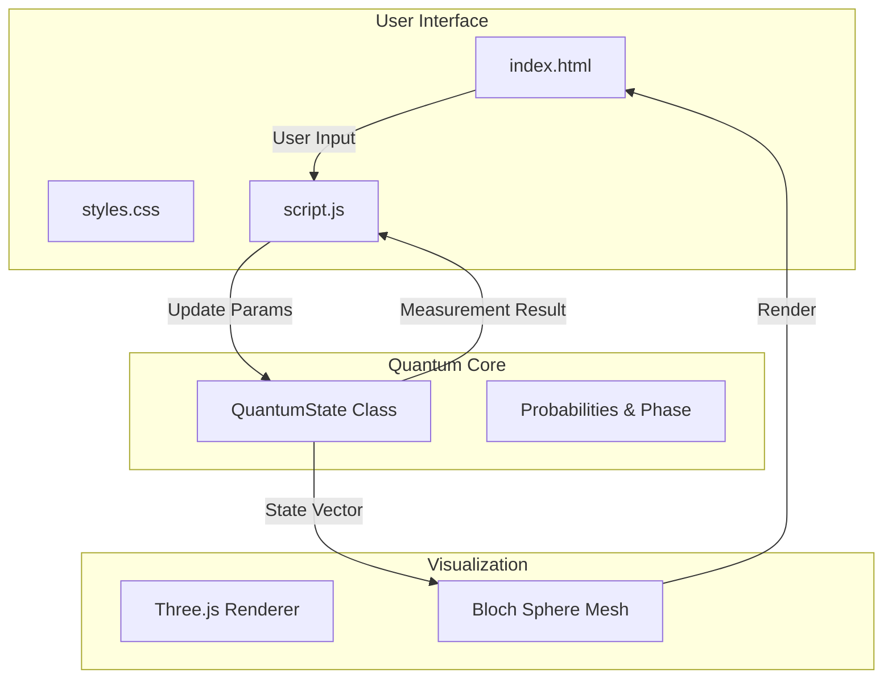

<div align="center">

# ⚛️ Quantum Whirl
### Interactive Quantum Coinflip & Bloch Sphere Explorer

[](https://developer.mozilla.org/en-US/docs/Web/HTML)
[](https://developer.mozilla.org/en-US/docs/Web/CSS)
[](https://developer.mozilla.org/en-US/docs/Web/JavaScript)
[](https://threejs.org/)
[](https://opensource.org/licenses/MIT)

<br />

[**Explore the Qubit**](#-quick-start) · [**View Demo**](#-screenshots) · [**Report Bug**](https://github.com/muhib-mehdi/quantum-coin-flip/issues)

</div>

---

## 📑 Table of Contents

- [Overview](#-overview)
- [Features](#-features)
- [Installation](#-installation)
- [Usage](#-usage)
- [Architecture](#-architecture)
- [Configuration](#-configuration)
- [Advanced Features](#-advanced-features)
- [Screenshots](#-screenshots)
- [Contributing](#-contributing)
- [License & Contact](#-license--contact)

---

## 🔮 Overview

**Quantum Whirl** is an interactive educational tool designed to visualize and simulate single-qubit quantum mechanics. Unlike standard educational tools that rely on static diagrams, Quantum Whirl provides a real-time, interactive **Bloch Sphere** and a **Quantum Coin Flip** experiment that demonstrates superposition, probability amplitudes, and measurement collapse.

### Why Choose Quantum Whirl?

| Feature | 🪙 Standard Coin Flip Sim | ⚛️ Quantum Whirl |
| :--- | :---: | :---: |
| **State Representation** | Binary (H or T) | Continuous Bloch Sphere |
| **Probability** | Fixed 50/50 | Adjustable Amplitudes (α, β) |
| **3D Visualization** | None | Interactive Three.js Sphere |
| **Math Transparency** | Hidden | Real-time Calculation Steps |
| **Quantum Concepts** | N/A | Superposition, Phase, Fidelity |

---

## ✨ Features

### 🧪 Quantum Simulation
- **Superposition:** Visualize states where the qubit exists in both |0⟩ and |1⟩ simultaneously.
- **Measurement Collapse:** Watch the state collapse to a basis state upon measurement (coin flip).
- **Quantum Noise:** Simulate environmental effects like **decoherence** and **entanglement**.

### 🧊 3D Visualization
- **Interactive Bloch Sphere:** Rotate and zoom to explore the qubit state vector in 3D space.
- **Dynamic State Vector:** Real-time updates to the vector position based on θ (theta) and φ (phi) parameters.
- **Visual Guides:** Equatorial and meridian rings for precise state tracking.

### 🎛️ Interactive UI
- **Real-time Parameters:** Adjust probabilities and angles using intuitive sliders.
- **Step-by-Step Math:** computation panel showing the exact math behind every quantum operation.
- **Immersive Design:** Particle background, custom cursor trails, and neon aesthetics.

---

## 🚀 Installation

### Prerequisites

| Software | Version | Description |
| :--- | :--- | :--- |
| **Node.js** | 14.x+ | Required for the dev server (optional if just opening HTML) |
| **Web Browser** | Modern | Chrome, Firefox, Edge, or Safari with WebGL support |

### Quick Start

1.  **Clone the Repository**
    ```bash
    git clone https://github.com/muhib-mehdi/quantum-coin-flip.git
    cd quantum-coin-flip
    ```

2.  **Install Dependencies (Optional)**
    If you want to use the included lightweight server:
    ```bash
    npm install
    ```

3.  **Run the Application**
    ```bash
    npm start
    ```
    *Or simply open `index.html` in your browser.*

---

## 🎮 Usage

### Workflow

```mermaid
graph LR
    A[Start] --> B[Explore Page]
    B --> C{Action}
    C -->|Adjust Sliders| D[Update Quantum State]
    C -->|Click Coin| E[Measure Qubit]
    D --> F[Bloch Sphere Updates]
    E --> G[Collapse Wavefunction]
    G --> H[Show Result |0⟩ or |1⟩]
```

1.  **Enter the Lab:** Click "Explore" on the landing page.
2.  **Define State:** Use the **Quantum Parameters** panel on the right to set your qubit's state (e.g., set `Alpha` to `0.5` for a 25% chance of Heads).
3.  **Visual Check:** Verify the state on the **Bloch Sphere** at the bottom right.
4.  **Experiment:** Click the **Quantum Coin** to perform a measurement.
5.  **Analyze:** Watch the **Computation Display** to see how probability + noise determined the outcome.

---

## 🏗️ Architecture

The application is built with a separation of concerns between the Physics engine, the Visualization layer, and the User Interface.



### Key Components

-   `quantum.js`: Contains the `QuantumState` class which handles all physics calculations (amplitudes, probabilities, noise simulation).
-   `script.js`: Manages UI interactions, custom cursor effects, and the particle background system.
-   `Three.js`: Used within `quantum.js` (and inline scripts) to render the 3D Bloch Sphere.

---

## ⚙️ Configuration

Expand the sections below to understand the adjustable parameters.

<details>
<summary><b>📐 Geometric Parameters (Bloch Sphere)</b></summary>
<br>

-   **θ (Theta):** The polar angle (0 to 180°). Determines the probability of |0⟩ vs |1⟩.
    -   0° = |0⟩ (Heads)
    -   180° = |1⟩ (Tails)
    -   90° = Superposition
-   **φ (Phi):** The azimuthal angle (0 to 360°). Represents the phase of the qubit.
-   **Phase (δ):** Additional global phase factor.
</details>

<details>
<summary><b>📉 Environmental Factors</b></summary>
<br>

-   **Entanglement Factor:** Simulates noise from entanglement with an environment, adding randomness to the probability distribution.
-   **Decoherence Rate (γ):** Simulates the loss of quantum coherence over time, pushing the state towards a classical mix.
-   **Fidelity:** Represents the quality of the quantum gate/operation.
</details>

---

## 🔬 Advanced Features

### Math Behind the Magic

The simulation calculates the probability of measuring state $|0\rangle$ using the Born rule, adjusted for environmental noise:

$$ P(|0\rangle) = |\alpha|^2 \times F + \epsilon_{noise} - \gamma_{decoherence} $$

Where:
-   $\alpha = \cos(\theta/2)$
-   $\beta = e^{i\phi}\sin(\theta/2)$
-   $F$ is the Fidelity factor.

### Keyboard Shortcuts

| Key | Action |
| :--- | :--- |
| `Space` | Flip Coin (Measure) |
| `R` | Reset Parameters |
| `Esc` | Return to Menu |

---

## 📸 Screenshots

<div align="center">
  
  <p><em>The Quantum Whirl Interface showing the Coin (left), Parameters (center), and Bloch Sphere (bottom right).</em></p>
</div>

---

## 🤝 Contributing

Contributions are what make the open-source community such an amazing place to learn, inspire, and create. Any contributions you make are **greatly appreciated**.

1.  Fork the Project
2.  Create your Feature Branch (`git checkout -b feature/AmazingFeature`)
3.  Commit your Changes (`git commit -m 'Add some AmazingFeature'`)
4.  Push to the Branch (`git push origin feature/AmazingFeature`)
5.  Open a Pull Request

---

## 📜 License & Contact

<div align="center">

[](LICENSE)

**Mehdi Hasan**

[](https://linkedin.com/in/muhib-mehdi)
[](https://github.com/muhib-mehdi)

</div>
